# AI SOC Scenarios - Detailed Agent Workflows

## Overview
This document describes how AI agents collaborate in each security scenario, including:
- IO Agent input handling
- Master Reasoning Agent (MRA) triage
- Specialized agent deployment
- Data source integration via MCP (Model Context Protocol)
- Inter-agent collaboration
- Actions and recommendations
- Knowledge Graph learning updates

---

## 1. AI-Driven Lateral Movement Detection in Post-Breach Scenarios

### IO Agent Input
- **Sources**: EDR alerts, Windows Event logs, Network flow data, Authentication logs
- **Trigger**: Multiple failed auth attempts, unusual service-to-service communications
- **Initial Data**: User account, source IP, target systems, time window

### MRA Triage Process
1. Analyzes authentication patterns across hybrid environment
2. Identifies potential compromised accounts
3. Maps network topology for affected segments
4. Prioritizes investigation based on asset criticality

### Specialized Agents Deployed
- **Credential Analysis Agent**: Monitors Kerberos tickets, NTLM hashes, token usage
- **Network Traversal Agent**: Tracks RDP, SSH, WinRM connections
- **Behavioral Baseline Agent**: Compares current vs historical user behavior
- **Sandbox Simulation Agent**: Replicates attacker techniques

### Data Sources (via MCP)
```
MCP Connectors:
- Active Directory (LDAP/Kerberos logs)
- EDR platforms (CrowdStrike, SentinelOne)
- Network TAPs and flow collectors
- Cloud identity providers (Azure AD, Okta)
- SIEM correlation engines
```

### Agent Collaboration Flow
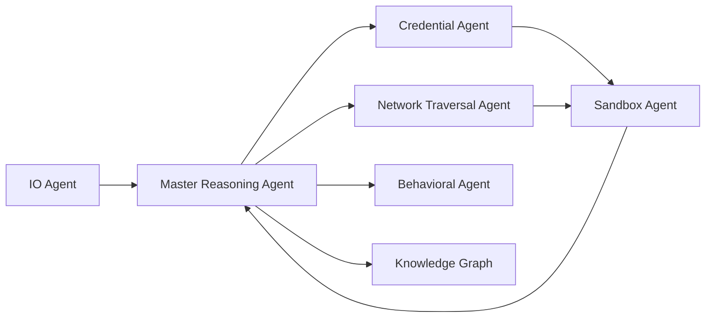

### Actions Taken
1. **Immediate**: Isolate suspected compromised accounts
2. **Investigation**: Trace lateral movement path
3. **Containment**: Block identified attack vectors
4. **Remediation**: Reset credentials, patch vulnerabilities

### Recommendations Generated
- Implement MFA on service accounts
- Segment network to limit lateral movement
- Deploy deception technology (honeypots)
- Update detection rules based on observed TTPs

### Knowledge Graph Updates
- Attack path patterns stored
- Compromised account behaviors cataloged
- Network traversal sequences mapped
- Success/failure rates of detection methods

---

## 2. AI Agent for Insider Threat Detection

### IO Agent Input
- **Sources**: HR systems, Email metadata, File access logs, Badge data
- **Trigger**: Abnormal data access patterns, sentiment changes, policy violations
- **Initial Data**: Employee ID, department, access history, recent activities

### MRA Triage Process
1. Establishes peer group baseline
2. Identifies deviation severity
3. Correlates with HR events (reviews, complaints)
4. Assesses data sensitivity accessed

### Specialized Agents Deployed
- **Behavioral Analytics Agent**: Models normal vs abnormal patterns
- **Sentiment Analysis Agent**: Processes communications (email, chat, tickets)
- **Data Movement Agent**: Tracks file operations, uploads, prints
- **Risk Scoring Agent**: Calculates threat probability

### Data Sources (via MCP)
```
MCP Connectors:
- Office 365 / Google Workspace APIs
- DLP systems (Forcepoint, Symantec)
- HR management systems
- Physical security systems
- Code repositories (Git, SVN)
```

### Agent Collaboration Flow
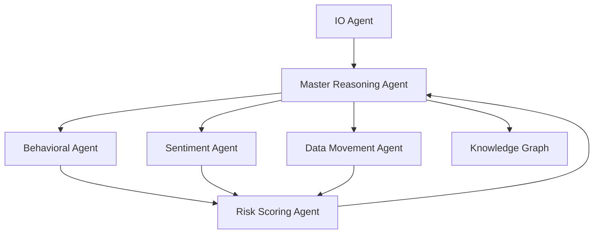

### Actions Taken
1. **Monitoring**: Enhanced logging on high-risk users
2. **Prevention**: Restrict access to sensitive data
3. **Investigation**: Deep dive into anomalous activities
4. **Intervention**: HR engagement for at-risk employees

### Recommendations Generated
- Implement user behavior analytics (UBA)
- Create data classification policies
- Establish clear termination procedures
- Deploy psychological safety programs

### Knowledge Graph Updates
- Insider threat indicators refined
- Peer group behavior models updated
- Risk factors weighted by outcome
- False positive patterns identified

---

## 3. Dark Web Threat Actor Tracking and Attack Prediction

### IO Agent Input
- **Sources**: Threat intel feeds, OSINT, Dark web forums, Paste sites
- **Trigger**: Company name mentions, industry targeting, exploit discussions
- **Initial Data**: Keywords, IOCs, threat actor profiles, target industries

### MRA Triage Process
1. Validates threat credibility
2. Links actors across platforms
3. Assesses targeting likelihood
4. Predicts attack timeline

### Specialized Agents Deployed
- **Web Scraping Agent**: Crawls forums, markets, chat rooms
- **NLP Analysis Agent**: Extracts entities, intents, capabilities
- **Actor Attribution Agent**: Links identities, tools, infrastructure
- **Predictive Modeling Agent**: Forecasts attack probability

### Data Sources (via MCP)
```
MCP Connectors:
- TOR network interfaces
- Telegram/Discord APIs
- Paste site monitors (Pastebin, GhostBin)
- Criminal forum scrapers
- Cryptocurrency transaction APIs
- WHOIS/DNS databases
```

### Agent Collaboration Flow
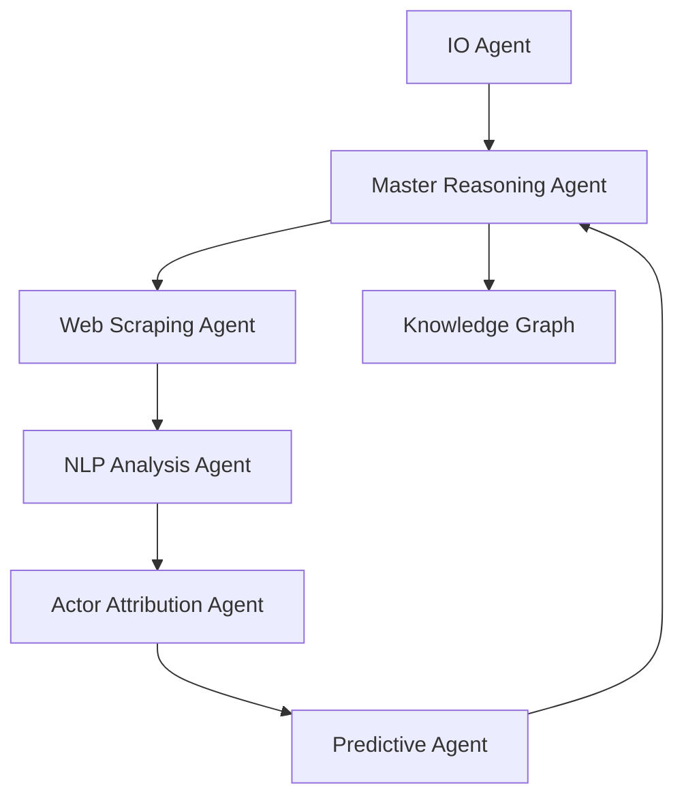

### Actions Taken
1. **Intelligence**: Create threat actor profiles
2. **Warning**: Alert on specific targeting
3. **Preparation**: Harden mentioned vulnerabilities
4. **Deception**: Deploy honeypots matching discussed targets

### Recommendations Generated
- Patch systems matching exploit discussions
- Monitor for specific IOCs
- Engage law enforcement if warranted
- Prepare incident response plans

### Knowledge Graph Updates
- Threat actor profiles enriched
- Attack pattern predictions refined
- Industry targeting trends mapped
- Underground economy dynamics tracked

---

## 4. Threat Detection Across Satellite or OT Networks

### IO Agent Input
- **Sources**: SCADA systems, ICS logs, Sensor telemetry, Protocol analyzers
- **Trigger**: Anomalous sensor readings, Protocol violations, Timing irregularities
- **Initial Data**: Device IDs, Normal baselines, Network topology, Process flows

### MRA Triage Process
1. Validates physical process constraints
2. Identifies safety-critical deviations
3. Maps potential cascade effects
4. Prioritizes by operational impact

### Specialized Agents Deployed
- **Signal Analysis Agent**: Time-series anomaly detection
- **Protocol Inspector Agent**: Deep packet inspection for OT protocols
- **Physics Model Agent**: Validates against physical laws
- **Safety System Agent**: Monitors fail-safes and interlocks

### Data Sources (via MCP)
```
MCP Connectors:
- OPC servers
- Modbus/DNP3 interfaces
- Historian databases (OSIsoft PI, Wonderware)
- PLC programming interfaces
- Satellite telemetry feeds
- Environmental sensors
```

### Agent Collaboration Flow
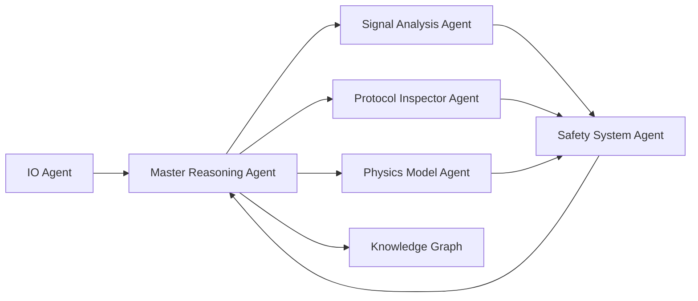

### Actions Taken
1. **Immediate**: Activate fail-safe modes
2. **Isolation**: Segment affected systems
3. **Validation**: Compare with digital twin
4. **Recovery**: Restore from known-good states

### Recommendations Generated
- Implement air-gap architectures
- Deploy OT-specific security tools
- Create physical process constraints
- Establish anomaly detection baselines

### Knowledge Graph Updates
- Normal operational patterns stored
- Attack signatures for OT environments
- Cascade failure sequences mapped
- Recovery procedures optimized

---

## 5. LLM-Based Phishing Triage at Scale

### IO Agent Input
- **Sources**: Email gateways, User reports, URL reputation, Attachment analysis
- **Trigger**: Suspicious emails, Volume spikes, New phishing techniques
- **Initial Data**: Email headers, Body content, URLs, Attachments, Sender reputation

### MRA Triage Process
1. Classifies email intent and sophistication
2. Identifies campaign patterns
3. Assesses targeting (spray vs spear)
4. Prioritizes by potential impact

### Specialized Agents Deployed
- **LLM Email Decoder Agent**: Understands context, intent, obfuscation
- **URL Analysis Agent**: Sandboxes and classifies destinations
- **Campaign Correlation Agent**: Links related phishing attempts
- **Visual Analysis Agent**: Screenshots and compares to legitimate sites

### Data Sources (via MCP)
```
MCP Connectors:
- Exchange/Gmail APIs
- URL sandboxing services
- Domain reputation databases
- Certificate transparency logs
- Brand protection services
- User training platforms
```

### Agent Collaboration Flow
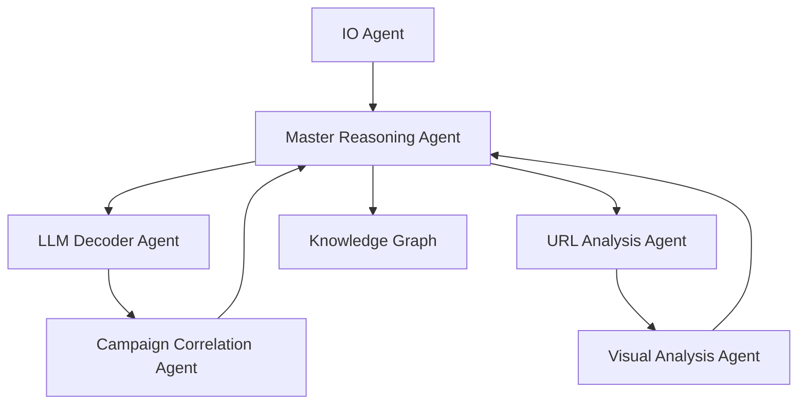

### Actions Taken
1. **Block**: Quarantine identified phishing
2. **Remediate**: Remove from all mailboxes
3. **Educate**: Alert and train affected users
4. **Hunt**: Search for related campaigns

### Recommendations Generated
- Update email filtering rules
- Implement DMARC/SPF/DKIM
- Enhance security awareness training
- Deploy anti-phishing toolbars

### Knowledge Graph Updates
- Phishing template library expanded
- Attack infrastructure mapped
- User susceptibility patterns tracked
- Training effectiveness measured

---

## 6. Autonomous Attack Story Reconstruction

### IO Agent Input
- **Sources**: All security tools, Forensic artifacts, Network captures, System logs
- **Trigger**: Post-incident analysis request, Breach confirmation
- **Initial Data**: Incident timeframe, Affected systems, Available evidence

### MRA Triage Process
1. Establishes incident timeline
2. Identifies data sources
3. Prioritizes evidence collection
4. Coordinates agent activities

### Specialized Agents Deployed
- **Forensic Timeline Agent**: Orders events chronologically
- **Root Cause Agent**: Identifies initial compromise
- **Impact Assessment Agent**: Maps data access/exfiltration
- **Attribution Agent**: Links to known actors/tools
- **Narrative Generation Agent**: Creates readable report

### Data Sources (via MCP)
```
MCP Connectors:
- SIEM platforms (Splunk, QRadar)
- EDR consoles
- Forensic images
- Memory dumps
- Network packet captures
- Cloud audit logs (AWS CloudTrail, Azure Monitor)
```

### Agent Collaboration Flow
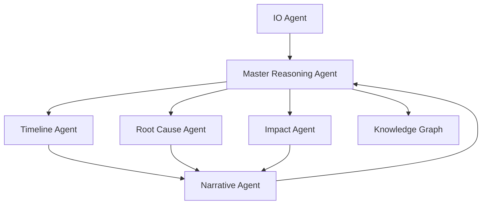

### Actions Taken
1. **Collection**: Gather all relevant artifacts
2. **Analysis**: Reconstruct attack chain
3. **Documentation**: Generate comprehensive report
4. **Presentation**: Create executive summary

### Recommendations Generated
- Patch identified vulnerabilities
- Update security controls
- Improve detection coverage
- Enhance response procedures

### Knowledge Graph Updates
- Attack patterns documented
- Tool signatures captured
- Response time metrics stored
- Lessons learned integrated

---

## 7. AI-Powered Zero-Day Exploit Detection

### IO Agent Input
- **Sources**: Endpoint telemetry, Crash dumps, System calls, Memory snapshots
- **Trigger**: Unusual process behavior, Unexplained crashes, Memory anomalies
- **Initial Data**: Process trees, Memory layouts, Execution patterns, Network activity

### MRA Triage Process
1. Analyzes behavioral anomalies
2. Compares against known exploits
3. Identifies unique characteristics
4. Assesses potential impact

### Specialized Agents Deployed
- **Behavioral Analysis Agent**: Process execution patterns
- **Memory Forensics Agent**: Heap/stack analysis
- **Syscall Monitor Agent**: System call sequences
- **Exploit Similarity Agent**: Compares to known techniques

### Data Sources (via MCP)
```
MCP Connectors:
- Kernel event tracing
- Process monitors
- Memory analysis tools
- Network behavior analysis
- Threat intelligence feeds
- Vulnerability databases
```

### Agent Collaboration Flow


### Actions Taken
1. **Isolate**: Contain affected processes
2. **Capture**: Preserve forensic evidence
3. **Analyze**: Deep-dive into exploit mechanics
4. **Protect**: Deploy temporary mitigations

### Recommendations Generated
- Create detection signatures
- Develop patches/workarounds
- Notify vendors
- Share threat intelligence

### Knowledge Graph Updates
- Zero-day characteristics cataloged
- Exploit techniques documented
- Detection patterns refined
- Mitigation effectiveness tracked

---

## 8. Cloud Misconfiguration & Data Exposure Detection

### IO Agent Input
- **Sources**: Cloud APIs, CSPM tools, Asset inventories, Access logs
- **Trigger**: Public exposure alerts, Permission changes, New deployments
- **Initial Data**: Cloud accounts, Resource lists, IAM policies, Network configs

### MRA Triage Process
1. Inventories cloud resources
2. Analyzes permission chains
3. Identifies exposure paths
4. Calculates risk scores

### Specialized Agents Deployed
- **Resource Discovery Agent**: Finds all cloud assets
- **Permission Analysis Agent**: Maps IAM relationships
- **Exposure Detection Agent**: Identifies public access
- **Compliance Check Agent**: Validates against standards

### Data Sources (via MCP)
```
MCP Connectors:
- AWS/Azure/GCP APIs
- Kubernetes APIs
- Container registries
- Infrastructure as Code repos
- Cloud security posture tools
- Compliance frameworks
```

### Agent Collaboration Flow
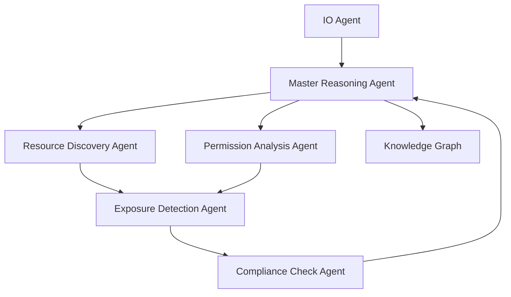

### Actions Taken
1. **Immediate**: Block public access
2. **Audit**: Review all permissions
3. **Remediate**: Fix misconfigurations
4. **Monitor**: Continuous compliance checks

### Recommendations Generated
- Implement least privilege
- Use cloud security tools
- Automate compliance checks
- Create configuration templates

### Knowledge Graph Updates
- Common misconfiguration patterns
- Permission chain vulnerabilities
- Compliance violation trends
- Remediation effectiveness

---

## 9. AI vs AI: Adversarial ML Attack Defense

### IO Agent Input
- **Sources**: ML model metrics, Training pipelines, Prediction logs, Model behavior
- **Trigger**: Accuracy degradation, Unusual predictions, Training anomalies
- **Initial Data**: Model performance metrics, Training data, Prediction patterns

### MRA Triage Process
1. Detects model performance shifts
2. Analyzes training data integrity
3. Identifies adversarial patterns
4. Assesses attack sophistication

### Specialized Agents Deployed
- **Model Monitor Agent**: Tracks performance metrics
- **Data Validation Agent**: Checks training data poisoning
- **Adversarial Detection Agent**: Identifies attack samples
- **Model Hardening Agent**: Implements defenses

### Data Sources (via MCP)
```
MCP Connectors:
- ML platforms (SageMaker, Vertex AI)
- Model registries
- Training data repositories
- Prediction APIs
- Feature stores
- Experiment tracking systems
```

### Agent Collaboration Flow
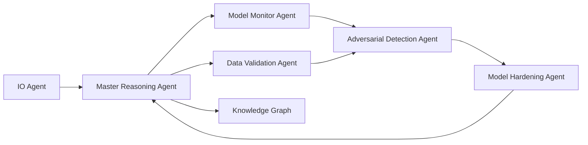

### Actions Taken
1. **Detect**: Identify adversarial inputs
2. **Clean**: Remove poisoned data
3. **Harden**: Retrain with defenses
4. **Monitor**: Enhanced detection

### Recommendations Generated
- Implement adversarial training
- Use ensemble methods
- Add input validation
- Deploy model monitoring

### Knowledge Graph Updates
- Adversarial attack patterns
- Model vulnerability mappings
- Defense effectiveness metrics
- Attack evolution tracking

---

## 10. Cryptojacking & Resource Abuse Detection

### IO Agent Input
- **Sources**: Cloud billing, Resource metrics, Process lists, Network traffic
- **Trigger**: Cost spikes, CPU anomalies, Unknown processes, Mining pool connections
- **Initial Data**: Resource usage, Process information, Network flows, Cost data

### MRA Triage Process
1. Analyzes resource consumption
2. Identifies mining signatures
3. Calculates financial impact
4. Traces infection vectors

### Specialized Agents Deployed
- **Resource Monitor Agent**: CPU/GPU usage patterns
- **Process Analysis Agent**: Identifies mining software
- **Network Traffic Agent**: Detects pool connections
- **Cost Analysis Agent**: Calculates financial impact

### Data Sources (via MCP)
```
MCP Connectors:
- Cloud provider APIs
- Container orchestration platforms
- System monitoring tools
- Network flow collectors
- Billing/cost management APIs
- Process monitoring tools
```

### Agent Collaboration Flow
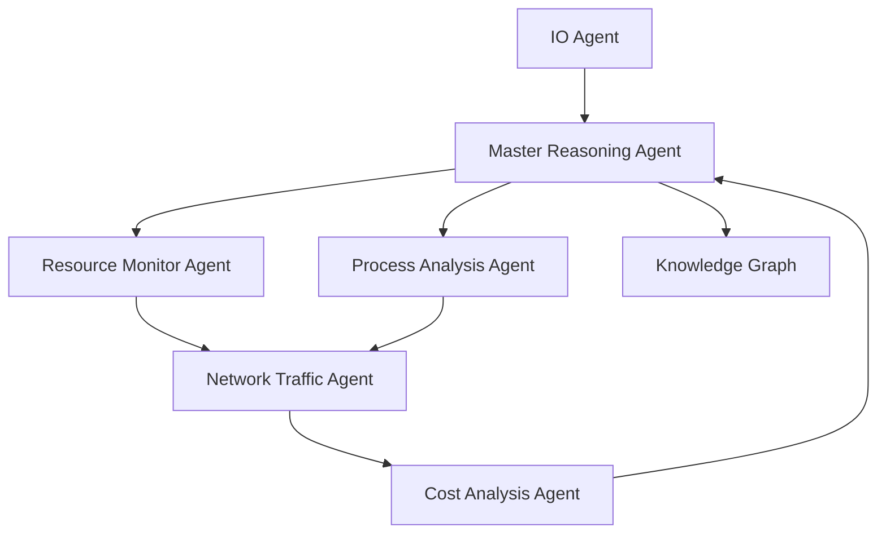

### Actions Taken
1. **Terminate**: Kill mining processes
2. **Block**: Firewall mining pools
3. **Investigate**: Find infection source
4. **Prevent**: Harden systems

### Recommendations Generated
- Implement resource quotas
- Monitor for mining indicators
- Use cloud security tools
- Regular security assessments

### Knowledge Graph Updates
- Mining software signatures
- Concealment techniques
- Resource abuse patterns
- Cost impact metrics

---

## 11. Automated Config Drift Detection (Network Devices)

### IO Agent Input
- **Sources**: Device configs, Change logs, Backup systems, Compliance tools
- **Trigger**: Unauthorized changes, Compliance violations, Scheduled audits
- **Initial Data**: Device inventory, Golden configs, Change tickets, Compliance rules

### MRA Triage Process
1. Compares current vs approved configs
2. Identifies unauthorized changes
3. Assesses security impact
4. Links to change tickets

### Specialized Agents Deployed
- **Config Collection Agent**: Gathers device configurations
- **Drift Analysis Agent**: Compares against baselines
- **Impact Assessment Agent**: Evaluates security implications
- **Remediation Agent**: Plans rollback/fixes

### Data Sources (via MCP)
```
MCP Connectors:
- Network device APIs (REST, NETCONF)
- Configuration backup systems
- Change management systems
- Compliance databases
- Vendor security advisories
- Network monitoring tools
```

### Agent Collaboration Flow
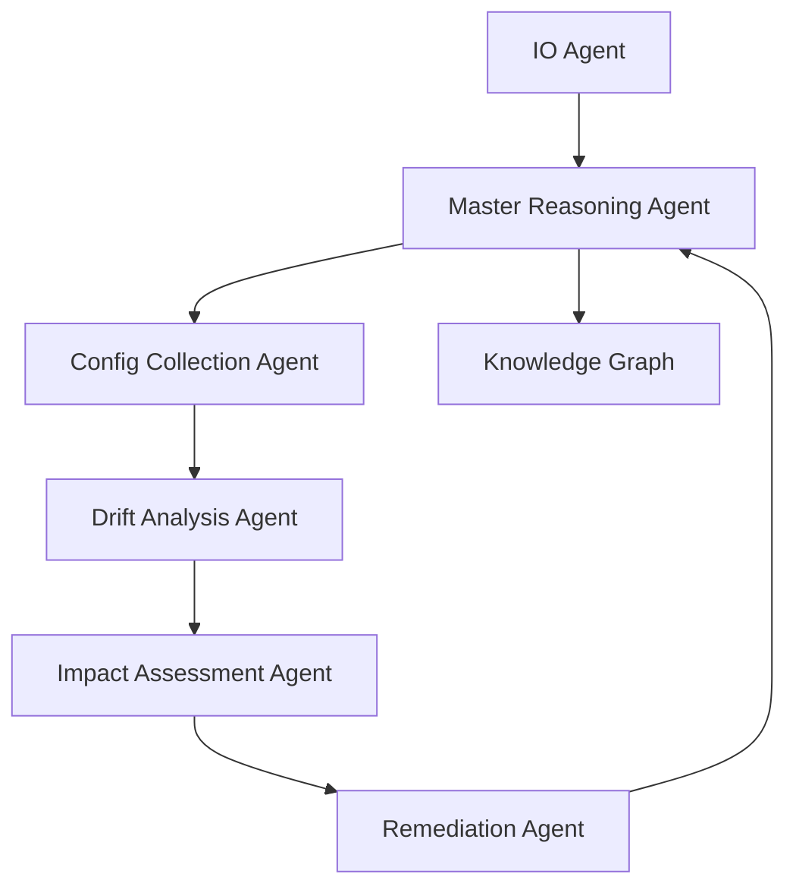

### Actions Taken
1. **Detect**: Identify configuration drifts
2. **Alert**: Notify of unauthorized changes
3. **Assess**: Evaluate security impact
4. **Remediate**: Auto-rollback critical changes

### Recommendations Generated
- Implement configuration management
- Use automated compliance checking
- Create approval workflows
- Deploy configuration backups

### Knowledge Graph Updates
- Common drift patterns
- Change impact correlations
- Device vulnerability mappings
- Remediation success rates

---

## 12. Vulnerability Management & Automated Remediation

### IO Agent Input
- **Sources**: Splunk logs, Vulnerability scanners, Asset inventory, Patch databases
- **Trigger**: New CVE announcement, Scanner alerts, Threat intel
- **Initial Data**: CVE details, Affected systems, Available patches, Business context

### MRA Triage Process
1. Identifies affected systems from logs
2. Assesses vulnerability severity
3. Maps business impact
4. Creates remediation timeline

### Specialized Agents Deployed
- **Asset Discovery Agent**: Finds all affected devices
- **Vulnerability Assessment Agent**: Analyzes exposure and impact
- **Patch Planning Agent**: Creates remediation strategy
- **Test Automation Agent**: Validates fixes in sandbox
- **Deployment Agent**: Executes approved changes

### Data Sources (via MCP)
```
MCP Connectors:
- Splunk API
- Vulnerability databases (NVD, vendor feeds)
- Asset management systems
- Patch management tools
- Lab/sandbox environments
- Change approval systems
```

### Agent Collaboration Flow
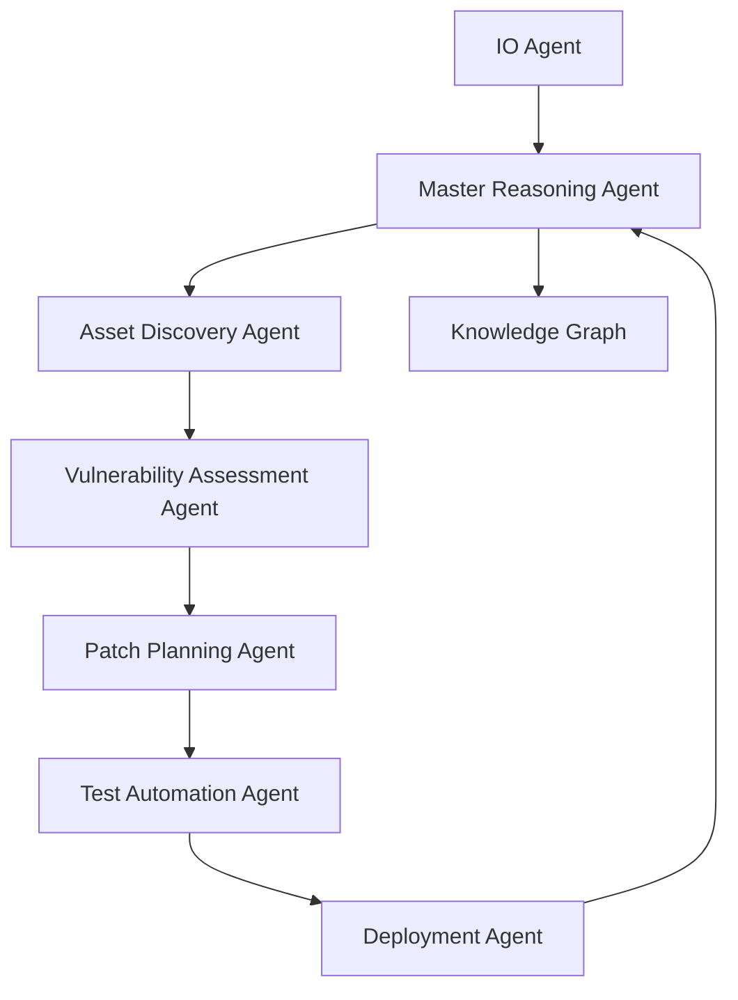

### Detailed Workflow
1. **Discovery Phase**
   - Query Splunk for all systems sending logs
   - Match system fingerprints against vulnerability
   - Create affected device inventory

2. **Assessment Phase**
   - Calculate CVSS scores
   - Determine exploit likelihood
   - Assess business criticality
   - Generate risk scores

3. **Planning Phase**
   - Create Method of Procedure (MoP)
   - Define patch groups/batches
   - Set maintenance windows
   - Identify dependencies

4. **Testing Phase**
   - Deploy patches to sandbox
   - Run functionality tests
   - Validate in lab environment
   - Document test results

5. **Deployment Phase**
   - Request approvals via workflow
   - Deploy to Batch 1 (low-impact)
   - Monitor for issues
   - Progressive rollout to remaining batches

### Actions Taken
1. **Immediate**: Identify and isolate critical systems
2. **Planning**: Generate detailed MoP
3. **Testing**: Validate in sandbox/lab
4. **Deployment**: Phased rollout with approvals

### Recommendations Generated
- Patch prioritization matrix
- Risk-based deployment schedule
- Rollback procedures
- Post-patch validation tests

### Knowledge Graph Updates
- Vulnerability-to-system mappings
- Patch success/failure rates
- Testing coverage metrics
- Deployment timeline optimization

---

## Knowledge Graph Architecture

### Core Components
1. **Entity Store**: Systems, users, vulnerabilities, threats
2. **Relationship Maps**: Dependencies, communications, trust relationships
3. **Behavioral Patterns**: Normal vs anomalous activities
4. **Historical Data**: Past incidents, resolutions, outcomes
5. **Predictive Models**: Risk scores, threat forecasts

### Learning Integration
- Each agent interaction updates the graph
- Success/failure metrics improve future decisions
- Pattern recognition becomes more accurate
- Relationships reveal hidden dependencies

### Query Examples
```cypher
// Find systems vulnerable to specific CVE
MATCH (s:System)-[:RUNS]->(sw:Software)-[:HAS_VULN]->(v:Vulnerability {cve: 'CVE-2024-12345'})
RETURN s.hostname, sw.version

// Identify lateral movement paths
MATCH path = (u:User)-[:AUTHENTICATED_TO*1..5]->(s:System)
WHERE u.risk_score > 80
RETURN path

// Predict likely targets
MATCH (a:Attacker)-[:TARGETS]->(pattern:Pattern)
MATCH (s:System)-[:MATCHES]->(pattern)
RETURN s.hostname, s.criticality
ORDER BY s.criticality DESC
```

---

## MCP Integration Points

### Data Source Categories
1. **Security Tools**: SIEM, EDR, SOAR, Vulnerability scanners
2. **IT Systems**: Active Directory, Cloud platforms, Network devices
3. **Business Systems**: HR, Finance, Asset management
4. **External Sources**: Threat intel, Dark web, Social media
5. **Operational Systems**: SCADA, ICS, IoT platforms

### Connection Methods
- REST APIs
- GraphQL interfaces
- Streaming protocols (Kafka, MQTT)
- Database connectors
- File system monitors
- Network taps

### Data Normalization
- Common data model (CDM) for all sources
- Entity resolution across systems
- Time synchronization
- Format standardization
- Deduplication

---

## Agent Collaboration Patterns

### Communication Methods
1. **Message Passing**: Async event-driven
2. **Shared Memory**: Knowledge graph queries
3. **Direct Invocation**: Synchronous calls
4. **Publish/Subscribe**: Topic-based updates

### Coordination Strategies
- **Hierarchical**: MRA coordinates specialized agents
- **Peer-to-Peer**: Agents collaborate directly
- **Blackboard**: Shared workspace for problem-solving
- **Contract Net**: Agents bid on tasks

### Conflict Resolution
- Priority-based decisions
- Consensus mechanisms
- MRA arbitration
- Evidence weighting

---

## 13. Long-Term Persistent Threat Detection (Multi-Year Breach)

### IO Agent Input
- **Sources**: Historical logs, Telecom billing systems, CDR records, Network traffic archives
- **Trigger**: Anomaly in subscriber data access, External threat intel, Regulatory audit
- **Initial Data**: Time range (3+ years), Affected subscriber count, Data types accessed

### MRA Triage Process
1. Establishes extended timeline analysis (years vs days)
2. Identifies persistence mechanisms
3. Maps data access patterns over time
4. Correlates with subscriber churn/complaints

### Specialized Agents Deployed
- **Historical Analysis Agent**: Processes years of archived data
- **Persistence Hunter Agent**: Finds backdoors, rootkits, C2 channels
- **Data Exfiltration Agent**: Tracks slow, low-volume data theft
- **Subscriber Impact Agent**: Analyzes affected customer patterns
- **Forensic Archaeology Agent**: Reconstructs deleted/rotated logs

### Data Sources (via MCP)
```
MCP Connectors:
- Telecom BSS/OSS systems
- Call Detail Records (CDR) databases
- Historical backup tapes/archives
- Network flow collectors (5+ year retention)
- Subscriber databases
- Billing systems
- Third-party threat intel on telecom APTs
```

### Agent Collaboration Flow
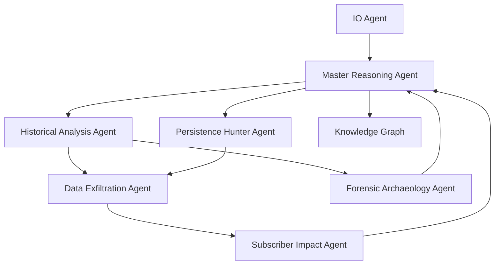

### Detailed Workflow

1. **Historical Deep Dive**
   - Analyze 3+ years of logs (if available)
   - Reconstruct from backups where logs rotated
   - Identify first signs of compromise
   - Map evolution of attacker techniques

2. **Persistence Mechanism Hunt**
   - Search for dormant backdoors
   - Identify legitimate tools used maliciously
   - Find modified system binaries
   - Detect covert channels in protocols

3. **Data Theft Pattern Analysis**
   - Low and slow exfiltration (MB/day over years)
   - Data disguised as legitimate traffic
   - Use of encrypted channels
   - Timing analysis (off-hours, holidays)

4. **Subscriber Impact Assessment**
   - Which subscribers targeted (VIP, government, corporate)
   - Types of data stolen (PII, CDRs, location)
   - Potential for SIM swapping or identity theft
   - Correlation with reported fraud cases

5. **Attribution and Intent**
   - Nation-state vs criminal indicators
   - Target selection patterns
   - TTP comparison with known APT groups
   - Geopolitical correlation

### Unique Challenges Addressed

1. **Log Rotation/Deletion**
   - Most logs only kept 90-180 days
   - Need to reconstruct from secondary sources
   - Correlate with business records

2. **Legitimate Tool Abuse**
   - Attackers use normal admin tools
   - Blend with regular operations
   - No malware signatures to detect

3. **Scale Issues**
   - 27 million records over 3 years
   - Petabytes of historical data
   - Need efficient analysis methods

4. **Evolving Techniques**
   - Attacker methods change over 3 years
   - Multiple operator handoffs
   - Tool and infrastructure updates

### Actions Taken
1. **Immediate**: Full infrastructure audit
2. **Investigation**: Multi-year forensic analysis
3. **Containment**: Remove all persistence mechanisms
4. **Notification**: Regulatory and customer communications
5. **Remediation**: Complete infrastructure rebuild

### Recommendations Generated
- Implement 3-year log retention for critical systems
- Deploy deception technology for early warning
- Create behavioral baselines for admin activities
- Establish "assume breach" security model
- Regular threat hunting exercises
- Implement zero-trust architecture

### Knowledge Graph Updates
- Long-term persistence techniques cataloged
- Telecom-specific attack patterns documented
- Data exfiltration over extended periods mapped
- Subscriber targeting profiles created
- Evolution of APT techniques tracked

### Key Indicators for Future Detection
```yaml
Behavioral Patterns:
  - Admin access from unusual locations
  - Bulk subscriber queries without tickets
  - Off-hours database exports
  - Encrypted traffic to uncommon destinations
  - Gradual privilege escalation over months

Technical Indicators:
  - Modified system binaries with valid signatures
  - Scheduled tasks with encoded commands
  - Registry keys for persistence
  - Unusual service accounts
  - Hidden file streams

Business Impact Indicators:
  - Increased subscriber complaints
  - Unusual SIM swap requests
  - Identity theft reports
  - Competitor intelligence advantages
```

### Lessons Learned Integration
- APTs can maintain access for years undetected
- Traditional IOC-based detection insufficient
- Need behavior-based detection over long timelines
- Importance of data classification and monitoring
- Regular "look-back" threat hunting critical

---

## 14. eBPF-Based Runtime Security & Kernel-Level Threat Detection

### IO Agent Input
- **Sources**: Isovalnt Tetragon/Cilium, eBPF programs, Kernel events, System calls
- **Trigger**: Kernel-level anomalies, Zero-day exploits, Container escapes, Rootkit activity
- **Initial Data**: Process lineage, Network flows, File operations, Kernel module loads

### MRA Triage Process
1. Analyzes kernel-level behavioral patterns
2. Correlates system calls with process intent
3. Maps container-to-host interactions
4. Identifies privilege escalation attempts

### Specialized Agents Deployed
- **Kernel Behavior Agent**: Monitors syscall patterns and kernel events
- **Container Security Agent**: Tracks container runtime anomalies
- **Network Policy Agent**: Enforces Cilium network policies
- **Process Lineage Agent**: Maps complete process trees
- **Runtime Protection Agent**: Takes immediate protective actions

### Data Sources (via MCP)
```
MCP Connectors:
- Isovalnt Tetragon API
- Cilium Hubble (network observability)
- eBPF maps and programs
- Kubernetes API (pod/container context)
- Container runtime (containerd/CRI-O)
- Kernel audit subsystem
- Falco runtime security
```

### Agent Collaboration Flow
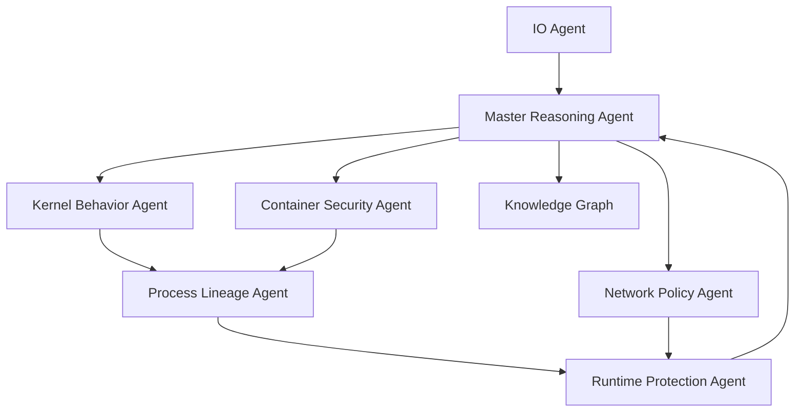

### Detailed Workflow

1. **Kernel Event Stream Processing**
   - Real-time syscall monitoring via eBPF
   - Process execution tracking (exec, fork, clone)
   - File access patterns (open, read, write)
   - Network socket operations
   - Capability and privilege changes

2. **Behavioral Analysis at Kernel Level**
   ```yaml
   Monitored Patterns:
   - Unusual syscall sequences
   - Kernel exploit primitives (spray, UAF)
   - Container breakout attempts
   - Rootkit installation behaviors
   - Fileless malware execution
   ```

3. **Container-Specific Detection**
   - Container escape attempts (CVE-2024-21626 patterns)
   - Kubernetes API abuse from pods
   - Sidecar container injection
   - Resource exhaustion attacks
   - Service mesh manipulation

4. **Network-Level Enforcement**
   - L3/L4/L7 policy violations via Cilium
   - Encrypted command & control detection
   - Lateral movement between pods
   - Data exfiltration patterns
   - DNS tunneling attempts

5. **Real-time Response Actions**
   - Process termination at kernel level
   - Network connection blocking
   - Container isolation/quarantine
   - Capability restriction
   - Resource limiting

### Unique eBPF/Isovalnt Capabilities

1. **Zero Overhead Monitoring**
   ```c
   // Example eBPF program structure
   SEC("tracepoint/syscalls/sys_enter_open")
   int trace_open(struct trace_event_raw_sys_enter* ctx) {
       // Capture file open attempts
       // Check against security policies
       // Alert or block if malicious
   }
   ```

2. **In-Kernel Policy Enforcement**
   - Block before userspace sees event
   - Prevent race conditions (TOCTTOU)
   - Immediate response (nanoseconds)

3. **Complete Observability**
   - Every packet (via XDP/TC)
   - Every syscall
   - Every file operation
   - Every process creation

4. **Container-Native Security**
   - Pod-to-pod communication mapping
   - Service identity verification
   - Workload fingerprinting

### Example Detections

1. **Container Escape Attempt**
   ```yaml
   Alert: Container Breakout Detected
   Process: /proc/self/exe
   Syscalls: mount, unshare, setns
   Action: Terminated process, isolated container
   ```

2. **Kernel Exploit in Progress**
   ```yaml
   Alert: Potential Privilege Escalation
   Pattern: Repeated failed syscalls followed by success
   Memory: Unusual kernel memory access
   Action: Blocked syscall, snapshot memory
   ```

3. **Cryptominer Injection**
   ```yaml
   Alert: Unauthorized Workload
   Process: High CPU usage, mining pool connections
   Network: Stratum protocol detected
   Action: CPU throttled, connections blocked
   ```

### Actions Taken
1. **Immediate**: Block malicious syscalls at kernel level
2. **Containment**: Isolate affected containers/pods
3. **Investigation**: Capture full execution context
4. **Prevention**: Update eBPF programs with new patterns
5. **Remediation**: Replace compromised containers

### Recommendations Generated
- Deploy Tetragon policies for critical workloads
- Implement Cilium network policies
- Enable kernel runtime protection
- Create workload behavior baselines
- Regular eBPF program updates

### Knowledge Graph Updates
- Kernel-level attack patterns
- Container escape techniques
- Runtime behavior profiles
- Service mesh communication maps
- eBPF program effectiveness

### Advanced eBPF Security Programs
```yaml
Security Programs:
  file_integrity:
    - Monitor critical file modifications
    - Track configuration changes
    - Alert on unauthorized access
  
  network_monitor:
    - Track all connection attempts
    - Detect port scanning
    - Identify C2 communications
  
  process_monitor:
    - Complete process lineage
    - Privilege escalation detection
    - Shellcode execution blocking
  
  container_security:
    - Namespace manipulation detection
    - Capability abuse prevention
    - Resource limit enforcement
```

### Integration with Cloud-Native Stack
- **Kubernetes**: Pod security policies via eBPF
- **Service Mesh**: Istio/Linkerd observability
- **Cloud Providers**: EKS/GKE/AKS runtime protection
- **CI/CD**: Build-time + runtime security

### Performance Impact
```yaml
Overhead Metrics:
  CPU: < 1% (kernel-space execution)
  Memory: ~50MB per node
  Latency: < 100ns per syscall
  Network: Zero-copy packet processing
```

### Future Enhancements
- ML models running in eBPF for instant decisions
- Distributed tracing across microservices
- Hardware offload for packet processing
- Integration with confidential computing

---

## 15. Container Image Vulnerability Scanning & Runtime Protection

### IO Agent Input
- **Sources**: Container registries, CI/CD pipelines, Kubernetes clusters, Image scanners
- **Trigger**: New image push, Deployment events, CVE announcements, Scheduled scans
- **Initial Data**: Image names/tags, Registry URLs, Deployment manifests, Base images

### MRA Triage Process
1. Identifies all container images in use
2. Prioritizes based on exposure (internet-facing, privileged)
3. Maps image inheritance chains
4. Correlates with runtime behavior

### Specialized Agents Deployed
- **Registry Scanner Agent**: Scans images in registries
- **Supply Chain Agent**: Tracks base image dependencies
- **Runtime Correlation Agent**: Maps vulnerabilities to running containers
- **Patch Intelligence Agent**: Finds available fixes
- **Compliance Validator Agent**: Checks against security policies

### Data Sources (via MCP)
```
MCP Connectors:
- Container registries (Harbor, ECR, ACR, GCR)
- Vulnerability scanners (Trivy, Grype, Clair)
- CVE databases (NVD, vendor-specific)
- Package managers (npm, pip, maven)
- Kubernetes API (running pods)
- SBOM (Software Bill of Materials) tools
- License compliance databases
```

### Agent Collaboration Flow
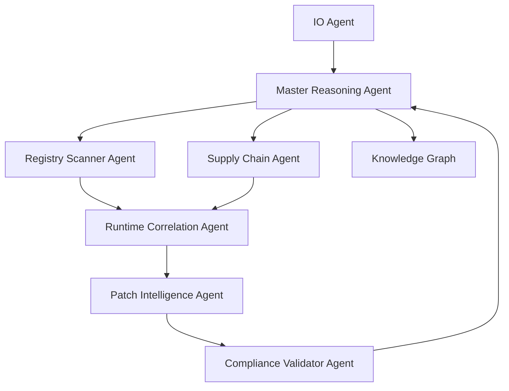

### Detailed Workflow

1. **Image Discovery & Inventory**
   ```yaml
   Scan Targets:
   - Production registries
   - Development registries
   - Local developer machines
   - CI/CD pipeline artifacts
   - Third-party/public images
   ```

2. **Multi-Layer Vulnerability Analysis**
   - OS packages (apt, yum, apk)
   - Language packages (npm, pip, gem, go modules)
   - Application dependencies
   - Configuration vulnerabilities
   - Secrets/credentials in layers

3. **Supply Chain Risk Assessment**
   - Base image trust verification
   - Dependency confusion attacks
   - Typosquatting detection
   - Outdated/abandoned packages
   - License compliance issues

4. **Runtime Correlation**
   ```yaml
   Runtime Mapping:
   - Which pods use vulnerable images
   - Network exposure of vulnerable containers
   - Privilege levels and capabilities
   - Data access permissions
   - Inter-service communications
   ```

5. **Intelligent Remediation Planning**
   - Identify available patches
   - Test compatibility
   - Plan rolling updates
   - Generate Dockerfiles with fixes
   - Create PR with updates

### Example Vulnerability Findings

1. **Critical Base Image Vulnerability**
   ```yaml
   Image: myapp:v2.1
   Base: ubuntu:20.04
   CVE: CVE-2024-3094 (xz backdoor)
   Severity: CRITICAL (CVSS 10.0)
   Running Pods: 47 across 3 clusters
   Exposure: Internet-facing
   Fix: Update to ubuntu:20.04.6
   ```

2. **Supply Chain Attack Risk**
   ```yaml
   Package: not-colors (typosquatting npm colors)
   Found in: frontend:latest
   Risk: Malicious code execution
   Impact: 12 production containers
   Action: Replace with legitimate 'colors' package
   ```

3. **Secrets in Image Layers**
   ```yaml
   Image: backend:prod
   Layer: sha256:a1b2c3d4...
   Finding: AWS credentials in /app/.env
   Risk: Cloud account compromise
   Action: Rebuild with secrets management
   ```

### Actions Taken
1. **Immediate**: Block deployment of critical vulnerabilities
2. **Scanning**: Continuous image analysis in registries
3. **Remediation**: Auto-generate patched images
4. **Prevention**: Admission control in Kubernetes
5. **Monitoring**: Track vulnerability lifecycle

### Recommendations Generated
- Implement image signing and verification
- Use minimal base images (distroless)
- Regular base image updates
- SBOM generation for all images
- Vulnerability gates in CI/CD

### Knowledge Graph Updates
- Image dependency trees
- Vulnerability propagation paths
- Patch success rates
- Common vulnerability patterns
- Supply chain relationships

### Integration with CI/CD
```yaml
Pipeline Integration:
  pre-build:
    - Scan base images
    - Check dependencies
  
  build-time:
    - Layer-by-layer analysis
    - Secret detection
    - License compliance
  
  pre-deploy:
    - Policy validation
    - Risk scoring
    - Approval gates
  
  runtime:
    - Continuous monitoring
    - Drift detection
    - Compliance validation
```

---

## 16. Source Code & GitHub Repository Security Scanning

### IO Agent Input
- **Sources**: GitHub/GitLab/Bitbucket, CI/CD systems, IDE plugins, Git hooks
- **Trigger**: Pull requests, Commits, Branch merges, Scheduled scans, Secret detection
- **Initial Data**: Repository URLs, Branch names, Commit hashes, File changes

### MRA Triage Process
1. Prioritizes repositories by criticality
2. Identifies sensitive code patterns
3. Maps code dependencies
4. Assesses exposure risk

### Specialized Agents Deployed
- **Code Analysis Agent**: Static/dynamic analysis
- **Secret Hunter Agent**: Finds exposed credentials
- **Dependency Checker Agent**: Vulnerable package detection
- **License Compliance Agent**: OSS license validation
- **Malicious Code Agent**: Detects backdoors/malware

### Data Sources (via MCP)
```
MCP Connectors:
- GitHub API / GitLab API / Bitbucket API
- SAST tools (SonarQube, Checkmarx, Fortify)
- Secret scanners (TruffleHog, GitLeaks)
- Dependency checkers (Dependabot, Snyk)
- License scanners (FOSSA, BlackDuck)
- Malware detection (VirusTotal, YARA)
- Code quality tools (ESLint, Pylint)
```

### Agent Collaboration Flow
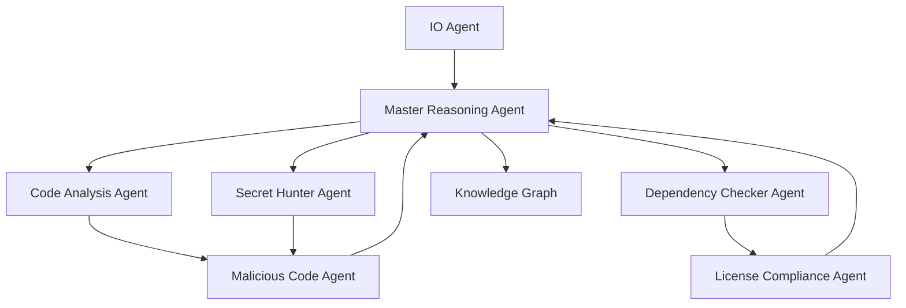

### Detailed Workflow

1. **Repository Discovery & Classification**
   ```yaml
   Repo Categories:
   - Production code
   - Infrastructure as Code
   - Configuration repos
   - Documentation
   - Archived/deprecated
   
   Risk Factors:
   - Public vs private
   - Number of contributors
   - External dependencies
   - Deployment targets
   ```

2. **Multi-Dimensional Code Analysis**
   - **Security Vulnerabilities**: SQL injection, XSS, buffer overflows
   - **Code Quality**: Complexity, duplication, test coverage
   - **Best Practices**: OWASP Top 10, CWE compliance
   - **Language-Specific**: Java deserialization, Python pickle, JS eval
   - **IaC Security**: Terraform misconfigs, K8s RBAC issues

3. **Secret Detection Patterns**
   ```yaml
   Secret Types:
   - API keys (AWS, Azure, GCP)
   - Database credentials
   - OAuth tokens
   - SSH private keys
   - Certificates
   - Webhook URLs
   - Encryption keys
   
   Detection Methods:
   - Regex patterns
   - Entropy analysis
   - Machine learning models
   - Historical leak correlation
   ```

4. **Dependency Risk Analysis**
   - Known vulnerabilities (CVEs)
   - Outdated packages
   - Abandoned projects
   - License conflicts
   - Transitive dependencies
   - Supply chain risks

5. **Malicious Code Detection**
   - Backdoor patterns
   - Crypto miners
   - Data exfiltration code
   - Obfuscated payloads
   - Suspicious network calls
   - Encoded/encrypted strings

### Example Findings

1. **Exposed AWS Credentials**
   ```yaml
   Repository: frontend-app
   File: src/config/aws.js
   Line: 23
   Secret Type: AWS Access Key
   Commit: abc123def
   Author: developer@company.com
   Age: 3 months
   Risk: Account takeover
   Action: Rotate immediately, scan CloudTrail
   ```

2. **Critical Dependency Vulnerability**
   ```yaml
   Repository: payment-service
   Package: log4j-core:2.14.1
   CVE: CVE-2021-44228 (Log4Shell)
   Severity: CRITICAL (CVSS 10.0)
   Fix: Update to 2.17.0
   Affected Files: 23
   Production Impact: HIGH
   ```

3. **Suspicious Code Pattern**
   ```yaml
   Repository: mobile-app
   File: src/utils/helper.js
   Pattern: Base64 encoded eval()
   Risk: Possible backdoor
   Code: eval(atob('Y29uc29sZS5sb2c='))
   Action: Manual review required
   ```

### Advanced Detection Capabilities

1. **AI-Powered Code Review**
   ```python
   # AI detects logic flaws
   def transfer_money(from_account, to_account, amount):
       # AI Alert: No authorization check
       # AI Alert: No rate limiting
       # AI Alert: Float precision issues
       from_account.balance -= amount
       to_account.balance += amount
   ```

2. **Behavioral Analysis**
   - Unusual commit patterns
   - Code injection attempts
   - Suspicious contributor activity
   - Branch protection bypasses

3. **Cross-Repository Intelligence**
   - Shared vulnerable code
   - Copy-pasted security flaws
   - Coordinated attacks
   - Supply chain mapping

### Actions Taken
1. **Immediate**: Block PR merge for critical issues
2. **Notification**: Alert developers and security team
3. **Remediation**: Auto-create fix PRs
4. **Prevention**: Pre-commit hooks installation
5. **Education**: Developer security training

### Recommendations Generated
- Enable branch protection rules
- Implement code signing
- Use security-focused linters
- Regular dependency updates
- Security champions program
- Automated security testing

### Knowledge Graph Updates
- Code vulnerability patterns
- Developer security practices
- Repository risk scores
- Dependency relationships
- Secret leak patterns

### Integration Examples

1. **GitHub Actions Integration**
   ```yaml
   name: Security Scan
   on: [push, pull_request]
   jobs:
     security:
       runs-on: ubuntu-latest
       steps:
         - uses: actions/checkout@v3
         - name: AI Security Scan
           uses: cisco/ai-security-scan@v1
           with:
             check-secrets: true
             check-vulnerabilities: true
             check-dependencies: true
             block-on-critical: true
   ```

2. **Pre-Commit Hook**
   ```bash
   #!/bin/bash
   # .git/hooks/pre-commit
   echo "Running AI security scan..."
   ai-scanner --pre-commit --fail-on-high
   ```

3. **IDE Integration**
   - Real-time vulnerability highlighting
   - Secure code suggestions
   - Dependency risk indicators
   - License compliance warnings

### Metrics and Reporting
```yaml
Dashboard Metrics:
  - Repositories scanned: 1,247
  - Critical vulnerabilities: 89
  - Secrets found: 234
  - Vulnerable dependencies: 1,456
  - Mean time to remediation: 4.2 hours
  - False positive rate: 3.2%
```

---

## Continuous Learning Framework

### Feedback Loops
1. **Outcome Tracking**: Success/failure of recommendations
2. **Human Feedback**: SOC analyst corrections
3. **Environmental Changes**: New threats, tools, techniques
4. **Performance Metrics**: Speed, accuracy, coverage

### Model Updates
- Online learning for quick adaptations
- Batch retraining for major updates
- Transfer learning from similar environments
- Federated learning across organizations

### Knowledge Retention
- Important patterns permanently stored
- Temporal decay for outdated information
- Compression of similar experiences
- Abstraction of general principles