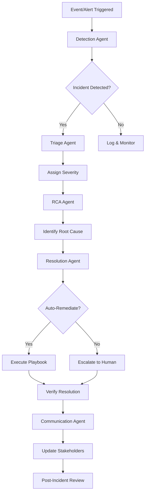
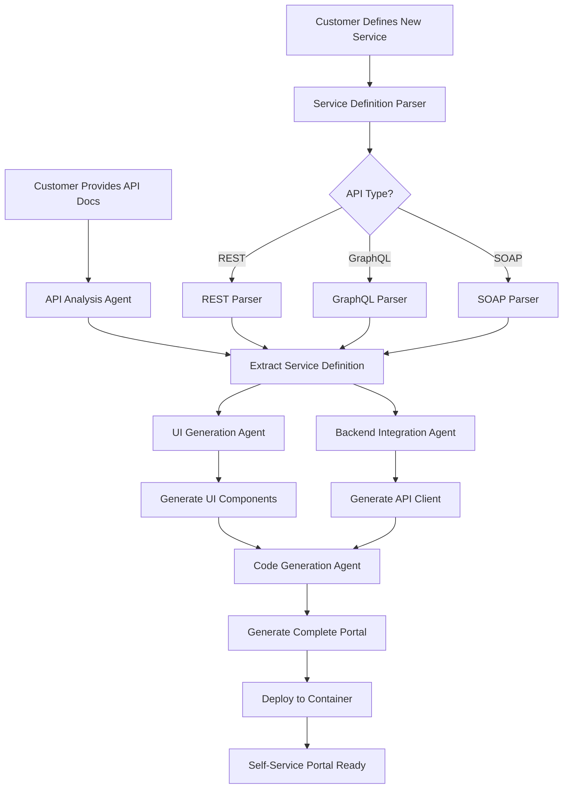

# Datacenter & Cloud Agentic AI Use Cases - Design Document v1.0

## Executive Summary
This document outlines the comprehensive design for implementing Agentic AI systems in datacenter and cloud environments. The solution leverages multiple specialized AI agents working collaboratively to manage, monitor, verify, and automate datacenter operations at scale.

## Table of Contents
1. [Architecture Overview](#architecture-overview)
2. [Use Case 1: Datacenter Incident Management](#use-case-1-datacenter-incident-management)
3. [Use Case 2: Datacenter Capacity Management](#use-case-2-datacenter-capacity-management)
4. [Use Case 3: Datacenter Resiliency Check](#use-case-3-datacenter-resiliency-check)
5. [Use Case 4: Datacenter Infrastructure Verification](#use-case-4-datacenter-infrastructure-verification)
6. [Use Case 5: Service Verification (Black Box & White Box)](#use-case-5-service-verification)
7. [Use Case 6: Service Creation Agent](#use-case-6-service-creation-agent)
8. [Implementation Roadmap](#implementation-roadmap)
9. [Technical Stack](#technical-stack)

---

## Architecture Overview

### Core Components
```
┌─────────────────────────────────────────────────────────────┐
│                    Orchestration Layer                       │
│  ┌──────────┐  ┌──────────┐  ┌──────────┐  ┌──────────┐   │
│  │   Task   │  │  Agent   │  │ Decision │  │  Action  │   │
│  │ Scheduler│  │Coordinator│ │  Engine  │  │ Executor │   │
│  └──────────┘  └──────────┘  └──────────┘  └──────────┘   │
└─────────────────────────────────────────────────────────────┘
                              │
┌─────────────────────────────────────────────────────────────┐
│                      Agent Layer                             │
│  ┌──────────┐  ┌──────────┐  ┌──────────┐  ┌──────────┐   │
│  │ Incident │  │ Capacity │  │Resiliency│  │  Infra   │   │
│  │  Agent   │  │  Agent   │  │  Agent   │  │  Agent   │   │
│  └──────────┘  └──────────┘  └──────────┘  └──────────┘   │
│  ┌──────────┐  ┌──────────┐  ┌──────────┐  ┌──────────┐   │
│  │ Service  │  │Creation  │  │Analytics │  │Compliance│   │
│  │Verificat.│  │  Agent   │  │  Agent   │  │  Agent   │   │
│  └──────────┘  └──────────┘  └──────────┘  └──────────┘   │
└─────────────────────────────────────────────────────────────┘
                              │
┌─────────────────────────────────────────────────────────────┐
│                    Integration Layer                         │
│  ┌──────────┐  ┌──────────┐  ┌──────────┐  ┌──────────┐   │
│  │  VMware  │  │OpenStack │  │Kubernetes│  │  Cloud   │   │
│  │  vSphere │  │   APIs   │  │   APIs   │  │  APIs    │   │
│  └──────────┘  └──────────┘  └──────────┘  └──────────┘   │
│  ┌──────────┐  ┌──────────┐  ┌──────────┐  ┌──────────┐   │
│  │Monitoring│  │   CMDB   │  │  Ticket  │  │  Network │   │
│  │   Tools  │  │  Systems │  │  Systems │  │  Devices │   │
│  └──────────┘  └──────────┘  └──────────┘  └──────────┘   │
└─────────────────────────────────────────────────────────────┘
```

### Agent Communication Protocol
- **Message Bus**: Apache Kafka / RabbitMQ for inter-agent communication
- **State Management**: Redis for shared state and coordination
- **Knowledge Base**: Graph database (Neo4j) for relationship mapping
- **Time-Series DB**: InfluxDB for metrics and performance data

---

## Use Case 1: Datacenter Incident Management

### Overview
AI-driven incident management system that automatically detects, triages, diagnoses, and resolves datacenter incidents with minimal human intervention.

### Agent Architecture

#### 1.1 Incident Detection Agent
**Responsibilities:**
- Monitor multiple data sources (logs, metrics, events, alerts)
- Pattern recognition for anomaly detection
- Correlation of events across systems
- Early warning system activation

**Capabilities:**
```python
class IncidentDetectionAgent:
    def __init__(self):
        self.data_sources = [
            'prometheus_metrics',
            'elasticsearch_logs',
            'splunk_events',
            'datadog_alerts',
            'custom_webhooks'
        ]
        self.ml_models = {
            'anomaly_detection': 'isolation_forest',
            'pattern_recognition': 'lstm_autoencoder',
            'correlation': 'graph_neural_network'
        }
    
    def detect_incidents(self):
        # Real-time streaming analysis
        # Multi-source correlation
        # Predictive incident detection
        pass
```

#### 1.2 Triage Agent
**Responsibilities:**
- Severity classification (P1-P5)
- Impact assessment
- Blast radius calculation
- Priority queue management

**Decision Matrix:**
| Severity | Customer Impact | System Impact | Response Time | Auto-Escalation |
|----------|----------------|---------------|---------------|-----------------|
| P1 | >1000 users | Core services down | <5 min | Immediate |
| P2 | 100-1000 users | Degraded performance | <15 min | 30 min |
| P3 | 10-100 users | Limited functionality | <1 hour | 2 hours |
| P4 | <10 users | Minor issues | <4 hours | 24 hours |
| P5 | No impact | Cosmetic/logging | <24 hours | None |

#### 1.3 Root Cause Analysis (RCA) Agent
**Responsibilities:**
- Dependency mapping
- Change correlation
- Historical pattern matching
- Hypothesis generation and testing

**Techniques:**
- Causal inference algorithms
- Temporal correlation analysis
- Service dependency graphs
- Configuration drift detection

#### 1.4 Resolution Agent
**Responsibilities:**
- Automated remediation execution
- Runbook automation
- Rollback management
- Verification and validation

**Remediation Actions:**
```yaml
remediation_playbooks:
  - high_cpu_usage:
      actions:
        - identify_process
        - check_historical_baseline
        - scale_horizontally
        - restart_service
        - notify_team
  
  - disk_space_critical:
      actions:
        - identify_large_files
        - clean_temp_directories
        - compress_old_logs
        - archive_to_cold_storage
        - expand_volume
  
  - network_connectivity:
      actions:
        - trace_route_analysis
        - check_firewall_rules
        - verify_dns_resolution
        - restart_network_services
        - failover_to_backup
```

#### 1.5 Communication Agent
**Responsibilities:**
- Stakeholder notification
- Status page updates
- Ticket creation/updates
- Post-incident reports

### Incident Workflow



---

## Use Case 2: Datacenter Capacity Management

### Overview
Proactive capacity planning and optimization using predictive analytics and ML models to ensure optimal resource utilization and prevent capacity-related outages.

### Agent Architecture

#### 2.1 Capacity Monitoring Agent
**Metrics Tracked:**
- CPU utilization (allocated vs. actual)
- Memory consumption patterns
- Storage growth rates
- Network bandwidth utilization
- Power and cooling capacity
- License utilization

**Data Collection:**
```python
class CapacityMonitoringAgent:
    def __init__(self):
        self.metrics = {
            'compute': ['cpu_cores', 'memory_gb', 'gpu_units'],
            'storage': ['used_tb', 'iops', 'throughput_mbps'],
            'network': ['bandwidth_gbps', 'packets_per_sec', 'latency_ms'],
            'facility': ['power_kw', 'cooling_btu', 'rack_units']
        }
        self.collection_interval = 60  # seconds
        
    def collect_metrics(self):
        # Pull from vCenter, Kubernetes, Cloud APIs
        # Aggregate across all infrastructure
        # Store in time-series database
        pass
```

#### 2.2 Predictive Analytics Agent
**Forecasting Models:**
- ARIMA for seasonal patterns
- Prophet for growth trends
- LSTM for complex patterns
- Ensemble methods for accuracy

**Prediction Horizons:**
| Timeframe | Use Case | Accuracy Target |
|-----------|----------|-----------------|
| 24 hours | Immediate scaling | >95% |
| 7 days | Weekly planning | >90% |
| 30 days | Monthly capacity | >85% |
| 90 days | Quarterly planning | >80% |
| 365 days | Annual budgeting | >75% |

#### 2.3 Optimization Agent
**Optimization Strategies:**
- Workload placement optimization
- Resource consolidation
- Power efficiency optimization
- Cost optimization
- Performance optimization

**Algorithms:**
```python
class OptimizationAgent:
    def __init__(self):
        self.optimization_algorithms = {
            'placement': 'genetic_algorithm',
            'consolidation': 'bin_packing',
            'scheduling': 'constraint_programming',
            'cost': 'linear_programming'
        }
    
    def optimize_placement(self, workloads, constraints):
        # Multi-objective optimization
        # Balance performance, cost, and reliability
        # Consider affinity/anti-affinity rules
        pass
```

#### 2.4 Capacity Planning Agent
**Planning Functions:**
- What-if scenario analysis
- Budget impact assessment
- Technology refresh planning
- Growth accommodation strategies

**Scenario Templates:**
```yaml
capacity_scenarios:
  - black_friday:
      expected_load: 5x
      duration: 72_hours
      resources_needed:
        compute: +300%
        storage: +150%
        network: +400%
      
  - new_product_launch:
      growth_rate: 50%_monthly
      duration: 6_months
      resources_needed:
        compute: exponential
        storage: linear
        network: stepped
```

### Capacity Dashboard Metrics

```
┌─────────────────────────────────────────────────────────────┐
│                 Current Capacity Utilization                 │
├─────────────┬────────────┬──────────┬──────────────────────┤
│ Resource    │ Used       │ Total    │ Utilization %        │
├─────────────┼────────────┼──────────┼──────────────────────┤
│ CPU Cores   │ 12,450     │ 16,000   │ 77.8% ████████░░    │
│ Memory (TB) │ 45.2       │ 64.0     │ 70.6% ███████░░░    │
│ Storage(PB) │ 2.8        │ 5.0      │ 56.0% ██████░░░░    │
│ Network(Gb) │ 850        │ 1000     │ 85.0% █████████░    │
│ Power (MW)  │ 4.2        │ 5.0      │ 84.0% ████████░░    │
└─────────────┴────────────┴──────────┴──────────────────────┘

┌─────────────────────────────────────────────────────────────┐
│              Predicted Capacity Requirements                 │
├──────────────┬──────────┬──────────┬──────────┬────────────┤
│ Resource     │ 7 Days   │ 30 Days  │ 90 Days  │ Action Req │
├──────────────┼──────────┼──────────┼──────────┼────────────┤
│ CPU Cores    │ 82%      │ 89%      │ 95%      │ Order Now  │
│ Memory (TB)  │ 73%      │ 78%      │ 85%      │ Plan Q2    │
│ Storage(PB)  │ 58%      │ 62%      │ 70%      │ OK         │
│ Network(Gb)  │ 87%      │ 92%      │ 98%      │ URGENT     │
│ Power (MW)   │ 85%      │ 88%      │ 91%      │ Plan Q2    │
└──────────────┴──────────┴──────────┴──────────┴────────────┘
```

---

## Use Case 3: Datacenter Resiliency Check

### Overview
Continuous validation of datacenter resilience through automated testing, failure simulation, and recovery verification.

### Agent Architecture

#### 3.1 Resilience Assessment Agent
**Assessment Areas:**
- High availability configurations
- Disaster recovery readiness
- Backup integrity
- Failover mechanisms
- Network redundancy
- Power redundancy

**Resilience Scoring:**
```python
class ResilienceAssessmentAgent:
    def __init__(self):
        self.resilience_factors = {
            'redundancy': 0.25,      # N+1, N+2, 2N
            'recovery_time': 0.20,   # RTO compliance
            'recovery_point': 0.20,  # RPO compliance
            'geographic_diversity': 0.15,
            'automation_level': 0.10,
            'testing_frequency': 0.10
        }
    
    def calculate_resilience_score(self):
        # Weighted scoring model
        # 0-100 scale
        # Real-time assessment
        pass
```

#### 3.2 Chaos Engineering Agent
**Failure Injection Scenarios:**
- Random pod/container termination
- Network partition simulation
- Disk failure simulation
- CPU/Memory stress testing
- Database connection drops
- API rate limiting

**Safety Controls:**
```yaml
chaos_experiments:
  blast_radius_controls:
    - environment: [dev, staging]  # Never production without approval
    - max_impact: 10%  # Maximum percentage of resources affected
    - duration: 300  # Maximum seconds for experiment
    - rollback: automatic  # Instant rollback on SLA breach
    
  experiments:
    - network_latency:
        target: microservices
        latency: 100ms
        probability: 0.3
        
    - pod_failure:
        target: stateless_services
        kill_rate: 1_per_minute
        max_pods: 5
```

#### 3.3 Failover Testing Agent
**Test Scenarios:**
- Planned failover drills
- Database failover testing
- Load balancer failover
- Site-to-site failover
- Application-level failover

**Test Execution:**
```python
class FailoverTestingAgent:
    def __init__(self):
        self.test_scenarios = {
            'database_failover': {
                'frequency': 'monthly',
                'duration': '30_minutes',
                'validation': ['data_integrity', 'connection_count', 'performance']
            },
            'site_failover': {
                'frequency': 'quarterly',
                'duration': '2_hours',
                'validation': ['dns_propagation', 'session_persistence', 'data_sync']
            }
        }
    
    def execute_failover_test(self, scenario):
        # Pre-flight checks
        # Execute failover
        # Monitor metrics
        # Validate success
        # Generate report
        pass
```

#### 3.4 Recovery Validation Agent
**Validation Checks:**
- Data integrity verification
- Service availability checks
- Performance benchmarking
- Configuration consistency
- Security posture validation

### Resiliency Dashboard

```
┌─────────────────────────────────────────────────────────────┐
│              Datacenter Resiliency Score: 94/100            │
├─────────────────────────────────────────────────────────────┤
│                                                              │
│  Component Status:                                           │
│  ├─ Compute Redundancy      [████████████████████░] 95%     │
│  ├─ Storage Redundancy      [█████████████████████] 99%     │
│  ├─ Network Redundancy      [████████████████████░] 96%     │
│  ├─ Power Redundancy        [███████████████████░░] 92%     │
│  ├─ Cooling Redundancy      [████████████████████░] 94%     │
│  └─ DR Readiness           [██████████████████░░░] 89%     │
│                                                              │
│  Recent Tests:                                               │
│  ✓ DB Failover Test        Passed    2024-01-15 14:30      │
│  ✓ Network Partition Test  Passed    2024-01-14 10:15      │
│  ✓ Power Transfer Test     Passed    2024-01-13 22:00      │
│  ⚠ Storage Failover Test   Warning   2024-01-12 16:45      │
│                                                              │
│  Next Scheduled Tests:                                       │
│  • Site Failover Drill     2024-01-20 02:00 (5 days)       │
│  • Chaos Experiment #47    2024-01-17 15:00 (2 days)       │
└─────────────────────────────────────────────────────────────┘
```

---

## Use Case 4: Datacenter Infrastructure Verification

### Overview
Automated verification and validation of datacenter infrastructure components, configurations, and compliance requirements.

### Agent Architecture

#### 4.1 Configuration Verification Agent
**Verification Scope:**
- Hardware configurations
- Firmware versions
- BIOS settings
- Network configurations
- Storage configurations
- Security settings

**Configuration Drift Detection:**
```python
class ConfigurationVerificationAgent:
    def __init__(self):
        self.baseline_configs = {}
        self.drift_threshold = 0.05  # 5% deviation allowed
        
    def detect_configuration_drift(self):
        current_config = self.collect_current_config()
        baseline = self.get_baseline_config()
        
        drift_items = []
        for component, config in current_config.items():
            if self.calculate_drift(config, baseline[component]) > self.drift_threshold:
                drift_items.append({
                    'component': component,
                    'expected': baseline[component],
                    'actual': config,
                    'severity': self.assess_severity(component)
                })
        return drift_items
```

#### 4.2 Compliance Verification Agent
**Compliance Frameworks:**
- CIS Benchmarks
- PCI-DSS
- HIPAA
- SOC 2
- ISO 27001
- Custom organizational policies

**Compliance Checks:**
```yaml
compliance_rules:
  pci_dss:
    - rule_id: 2.2.3
      description: "Encrypt all non-console administrative access"
      check_type: configuration
      validation:
        ssh_config:
          protocol: 2
          permit_root_login: no
          password_authentication: no
          
    - rule_id: 8.2.3
      description: "Strong password requirements"
      check_type: policy
      validation:
        password_policy:
          min_length: 12
          complexity: high
          expiry_days: 90
```

#### 4.3 Hardware Health Agent
**Monitoring Points:**
- CPU health and temperatures
- Memory ECC errors
- Disk SMART status
- Power supply status
- Fan speeds and temperatures
- Network interface errors

**Predictive Maintenance:**
```python
class HardwareHealthAgent:
    def __init__(self):
        self.failure_predictors = {
            'disk': ['reallocated_sectors', 'spin_retry_count', 'temperature'],
            'memory': ['ecc_errors', 'temperature', 'voltage'],
            'cpu': ['temperature', 'throttling_events', 'machine_check_errors']
        }
    
    def predict_failure_probability(self, component_type, metrics):
        # ML model for failure prediction
        # Based on historical failure data
        # Returns probability and estimated time to failure
        pass
```

#### 4.4 Network Verification Agent
**Network Validations:**
- Connectivity matrix testing
- Bandwidth verification
- Latency measurements
- MTU verification
- VLAN configurations
- Routing table validation

### Infrastructure Verification Report

```
┌─────────────────────────────────────────────────────────────┐
│           Infrastructure Verification Summary                │
├─────────────────────────────────────────────────────────────┤
│                                                              │
│  Overall Health Score: 96.5%                                │
│                                                              │
│  Configuration Compliance:                                   │
│  ├─ Servers:        847/850 compliant  (99.6%)             │
│  ├─ Network:        142/145 compliant  (97.9%)             │
│  ├─ Storage:        48/48 compliant    (100%)              │
│  └─ Security:       95/98 compliant    (96.9%)             │
│                                                              │
│  Configuration Drift Detected:                               │
│  • server-db-01:    MySQL max_connections (100 → 150)      │
│  • switch-core-02:  VLAN 200 missing                       │
│  • firewall-dmz-01: Rule #45 modified                      │
│                                                              │
│  Hardware Health Alerts:                                     │
│  ⚠ server-app-23:  Disk sda showing pre-failure (7 days)  │
│  ⚠ server-web-15:  Memory DIMM_A2 ECC errors increasing   │
│  ⚠ switch-tor-08:  PSU_2 efficiency degraded              │
│                                                              │
│  Compliance Status:                                          │
│  ✓ PCI-DSS:        Compliant (last audit: 2024-01-10)     │
│  ✓ SOC 2:          Compliant (last audit: 2024-01-05)     │
│  ⚠ CIS Benchmark:  3 medium findings                       │
└─────────────────────────────────────────────────────────────┘
```

---

## Use Case 5: Service Verification (Black Box & White Box)

### Overview
Comprehensive testing of datacenter services using both black box (external) and white box (internal) testing methodologies.

### Service Types Under Test
1. **Virtual Machines (VMs)**
2. **Container Clusters (Kubernetes/OpenShift)**
3. **Message Queues as a Service (Kafka/RabbitMQ)**
4. **Databases as a Service (MySQL/PostgreSQL/MongoDB)**
5. **MicroVMs as a Service (Firecracker/Kata)**

### Agent Architecture

#### 5.1 Black Box Testing Agent
**Testing Approach:**
- No knowledge of internal implementation
- API-based testing
- User perspective validation
- End-to-end testing

**Test Scenarios:**
```python
class BlackBoxTestingAgent:
    def __init__(self):
        self.test_suites = {
            'vm_service': VMServiceBlackBoxTests(),
            'container_service': ContainerServiceBlackBoxTests(),
            'mq_service': MessageQueueBlackBoxTests(),
            'db_service': DatabaseBlackBoxTests(),
            'microvm_service': MicroVMBlackBoxTests()
        }
    
    def test_vm_service(self):
        tests = [
            'provision_vm_test',
            'resize_vm_test',
            'snapshot_restore_test',
            'network_connectivity_test',
            'performance_benchmark_test',
            'api_response_time_test'
        ]
        return self.execute_tests('vm_service', tests)
```

**VM Service Black Box Tests:**
```yaml
vm_black_box_tests:
  provision_test:
    steps:
      - create_vm_via_api
      - wait_for_ready_state
      - verify_ssh_access
      - verify_network_connectivity
      - verify_disk_size
      - verify_cpu_memory
    expected_time: <5_minutes
    success_criteria:
      - vm_accessible: true
      - resources_match_request: true
      
  performance_test:
    workloads:
      - cpu_intensive
      - memory_intensive
      - disk_io_intensive
      - network_intensive
    metrics:
      - throughput
      - latency
      - iops
      - response_time
```

**Container Cluster Black Box Tests:**
```python
class ContainerServiceBlackBoxTests:
    def test_kubernetes_cluster(self):
        tests = {
            'cluster_creation': self.test_create_cluster,
            'pod_deployment': self.test_deploy_pod,
            'scaling': self.test_horizontal_scaling,
            'load_balancing': self.test_load_balancer,
            'persistent_storage': self.test_pvc_binding,
            'network_policies': self.test_network_isolation,
            'rbac': self.test_rbac_policies,
            'ingress': self.test_ingress_routing
        }
        
        results = {}
        for test_name, test_func in tests.items():
            results[test_name] = test_func()
        
        return results
```

**Message Queue Black Box Tests:**
```yaml
mq_black_box_tests:
  kafka_tests:
    - producer_performance:
        messages_per_sec: 100000
        message_size: 1024
        duration: 60
        expected_success_rate: 99.9%
        
    - consumer_lag:
        max_allowed_lag: 1000
        consumer_groups: 10
        partitions: 50
        
    - failure_recovery:
        kill_brokers: 2
        expected_recovery_time: <30s
        data_loss_tolerance: 0
```

**Database Service Black Box Tests:**
```python
class DatabaseBlackBoxTests:
    def test_database_service(self, db_type):
        test_matrix = {
            'mysql': {
                'connection_pool': 100,
                'transactions_per_sec': 1000,
                'query_complexity': ['simple', 'join', 'aggregate'],
                'backup_restore': True,
                'replication_lag': '<1s'
            },
            'postgresql': {
                'connection_pool': 200,
                'transactions_per_sec': 1500,
                'query_complexity': ['simple', 'join', 'window', 'cte'],
                'backup_restore': True,
                'replication_lag': '<500ms'
            },
            'mongodb': {
                'connection_pool': 150,
                'operations_per_sec': 5000,
                'query_complexity': ['find', 'aggregate', 'mapreduce'],
                'backup_restore': True,
                'replica_set_lag': '<2s'
            }
        }
        
        return self.execute_db_tests(db_type, test_matrix[db_type])
```

#### 5.2 White Box Testing Agent
**Testing Approach:**
- Full knowledge of internal implementation
- Code coverage analysis
- Internal state validation
- Component integration testing

**Test Implementation:**
```python
class WhiteBoxTestingAgent:
    def __init__(self):
        self.coverage_threshold = 80  # minimum code coverage
        self.internal_access = {
            'ssh_keys': 'loaded',
            'api_tokens': 'loaded',
            'database_creds': 'loaded',
            'monitoring_access': 'configured'
        }
    
    def test_internal_components(self, service_type):
        if service_type == 'vm_service':
            return self.test_vm_internals()
        elif service_type == 'container_service':
            return self.test_container_internals()
        # ... other services
```

**VM Service White Box Tests:**
```yaml
vm_white_box_tests:
  hypervisor_tests:
    - resource_allocation:
        check: cpu_pinning
        validate: numa_awareness
        verify: memory_ballooning
        
    - storage_backend:
        check: lvm_configuration
        validate: snapshot_chains
        verify: thin_provisioning
        
    - network_virtualization:
        check: ovs_flows
        validate: vxlan_tunnels
        verify: security_groups
```

**Container White Box Tests:**
```python
class ContainerWhiteBoxTests:
    def test_kubernetes_internals(self):
        tests = {
            'etcd_health': self.check_etcd_cluster,
            'api_server': self.validate_api_server,
            'scheduler': self.test_scheduler_decisions,
            'controller_manager': self.verify_controllers,
            'kubelet': self.test_node_agents,
            'container_runtime': self.verify_runtime,
            'cni_plugins': self.test_network_plugins,
            'csi_drivers': self.test_storage_drivers
        }
        
        return self.execute_internal_tests(tests)
    
    def check_etcd_cluster(self):
        # Check etcd cluster health
        # Verify data consistency
        # Check latency metrics
        # Validate backup status
        pass
```

**MicroVM White Box Tests:**
```yaml
microvm_white_box_tests:
  firecracker_tests:
    - boot_time:
        target: <125ms
        measure: kernel_boot + init
        
    - memory_overhead:
        target: <5MB
        measure: per_vm_overhead
        
    - io_performance:
        storage_driver: virtio
        network_driver: virtio
        expected_iops: 50000
        
    - security_isolation:
        check: seccomp_filters
        verify: cgroup_limits
        validate: namespace_isolation
```

#### 5.3 Service Verification Dashboard

```
┌─────────────────────────────────────────────────────────────┐
│            Service Verification Test Results                 │
├─────────────────────────────────────────────────────────────┤
│                                                              │
│  VM Service Testing:                                         │
│  ├─ Black Box Tests:    45/48 Passed  (93.75%)             │
│  │  ├─ Provisioning:    ✓ Passed (avg: 3.2 min)           │
│  │  ├─ Performance:     ✓ Passed (CPU: 98%, Mem: 96%)     │
│  │  ├─ Networking:      ✓ Passed (Latency: 0.8ms)         │
│  │  └─ API Tests:       ⚠ 3 Failed (Timeout issues)       │
│  │                                                          │
│  └─ White Box Tests:    52/54 Passed  (96.30%)             │
│     ├─ Hypervisor:      ✓ All checks passed               │
│     ├─ Storage:         ✓ LVM configured correctly        │
│     └─ Networking:      ⚠ 2 OVS flow issues               │
│                                                              │
│  Container Service Testing (Kubernetes):                     │
│  ├─ Black Box Tests:    38/40 Passed  (95.00%)             │
│  │  ├─ Deployment:      ✓ 100 pods < 30s                  │
│  │  ├─ Scaling:         ✓ HPA working correctly           │
│  │  ├─ Load Balancing:  ✓ Traffic distributed evenly      │
│  │  └─ Storage:         ⚠ PVC binding slow (>1min)        │
│  │                                                          │
│  └─ White Box Tests:    41/42 Passed  (97.62%)             │
│     ├─ etcd:            ✓ Cluster healthy                 │
│     ├─ API Server:      ✓ Response time < 100ms           │
│     └─ Scheduler:       ⚠ 1 node affinity issue           │
│                                                              │
│  Database Service Testing:                                   │
│  ├─ MySQL:              48/50 Passed  (96.00%)             │
│  ├─ PostgreSQL:         49/50 Passed  (98.00%)             │
│  └─ MongoDB:            47/50 Passed  (94.00%)             │
│                                                              │
│  Message Queue Testing:                                      │
│  ├─ Kafka:              35/36 Passed  (97.22%)             │
│  └─ RabbitMQ:           33/34 Passed  (97.06%)             │
│                                                              │
│  MicroVM Service Testing:                                    │
│  ├─ Boot Time:          ✓ 118ms average                    │
│  ├─ Memory Overhead:    ✓ 4.2MB per VM                     │
│  └─ Isolation:          ✓ All security checks passed       │
└─────────────────────────────────────────────────────────────┘
```

---

## Use Case 6: Service Creation Agent

### Overview
An intelligent agent system that automatically creates self-service portals for any infrastructure service by analyzing API documentation and generating both UI and backend integration code.

### Agent Architecture

#### 6.1 API Analysis Agent
**Capabilities:**
- Parse API documentation (OpenAPI/Swagger, GraphQL, REST docs)
- Extract endpoints, parameters, and data models
- Identify authentication methods
- Map API capabilities to UI components

```python
class APIAnalysisAgent:
    def __init__(self):
        self.supported_formats = ['openapi', 'swagger', 'graphql', 'rest']
        self.parser_engine = MultiFormatParser()
        
    def analyze_api_documentation(self, api_doc_url):
        """
        Analyzes API documentation and extracts service capabilities
        """
        api_spec = self.parser_engine.parse(api_doc_url)
        
        return {
            'endpoints': self.extract_endpoints(api_spec),
            'data_models': self.extract_models(api_spec),
            'authentication': self.extract_auth_methods(api_spec),
            'rate_limits': self.extract_rate_limits(api_spec),
            'examples': self.extract_examples(api_spec)
        }
    
    def extract_endpoints(self, spec):
        endpoints = []
        for path, methods in spec['paths'].items():
            for method, details in methods.items():
                endpoints.append({
                    'path': path,
                    'method': method.upper(),
                    'description': details.get('description'),
                    'parameters': details.get('parameters', []),
                    'request_body': details.get('requestBody'),
                    'responses': details.get('responses')
                })
        return endpoints
```

#### 6.2 UI Generation Agent
**Capabilities:**
- Generate React/Vue/Angular components
- Create forms based on API parameters
- Build data tables for list operations
- Generate charts and visualizations
- Implement responsive design

```python
class UIGenerationAgent:
    def __init__(self):
        self.ui_frameworks = ['react', 'vue', 'angular']
        self.component_library = 'material-ui'  # or 'antd', 'bootstrap'
        
    def generate_ui_components(self, service_definition):
        """
        Generates complete UI based on service definition
        """
        components = {
            'service_dashboard': self.create_dashboard(service_definition),
            'create_form': self.create_resource_form(service_definition),
            'list_view': self.create_list_view(service_definition),
            'detail_view': self.create_detail_view(service_definition),
            'action_buttons': self.create_action_buttons(service_definition),
            'monitoring_widgets': self.create_monitoring_widgets(service_definition)
        }
        
        return self.compile_ui_package(components)
    
    def create_resource_form(self, service_def):
        """
        Creates a form component for resource creation
        """
        form_fields = []
        for param in service_def['create_parameters']:
            field = {
                'name': param['name'],
                'type': self.map_to_ui_input_type(param['type']),
                'label': param['description'],
                'required': param.get('required', False),
                'validation': self.generate_validation_rules(param),
                'help_text': param.get('help_text', '')
            }
            form_fields.append(field)
        
        return self.render_form_component(form_fields)
```

#### 6.3 Backend Integration Agent
**Capabilities:**
- Generate API client code
- Implement authentication flows
- Handle error responses
- Implement retry logic
- Cache responses when appropriate

```python
class BackendIntegrationAgent:
    def __init__(self):
        self.languages = ['python', 'javascript', 'java', 'go']
        
    def generate_api_client(self, api_spec, language='python'):
        """
        Generates API client code in specified language
        """
        client_code = {
            'base_client': self.generate_base_client(api_spec),
            'auth_handler': self.generate_auth_handler(api_spec),
            'resource_clients': self.generate_resource_clients(api_spec),
            'error_handler': self.generate_error_handler(api_spec),
            'utils': self.generate_utilities(api_spec)
        }
        
        return self.compile_client_package(client_code, language)
    
    def generate_base_client(self, api_spec):
        """
        Generates base HTTP client with common functionality
        """
        return f"""
        class {api_spec['service_name']}Client:
            def __init__(self, base_url, auth_token=None):
                self.base_url = base_url
                self.auth_token = auth_token
                self.session = requests.Session()
                self.setup_auth()
            
            def setup_auth(self):
                if self.auth_token:
                    self.session.headers['Authorization'] = f'Bearer {self.auth_token}'
            
            def request(self, method, endpoint, **kwargs):
                url = f'{self.base_url}{endpoint}'
                response = self.session.request(method, url, **kwargs)
                response.raise_for_status()
                return response.json()
        """
```

#### 6.4 Code Generation Agent
**Capabilities:**
- Generate complete service implementation
- Create deployment configurations
- Generate documentation
- Create test suites

```python
class CodeGenerationAgent:
    def __init__(self):
        self.template_engine = TemplateEngine()
        
    def generate_service_portal(self, service_definition):
        """
        Generates complete self-service portal
        """
        generated_artifacts = {
            'frontend': {
                'components': self.generate_ui_components(service_definition),
                'styles': self.generate_styles(service_definition),
                'routes': self.generate_routes(service_definition),
                'state_management': self.generate_state_management(service_definition)
            },
            'backend': {
                'api_gateway': self.generate_api_gateway(service_definition),
                'service_layer': self.generate_service_layer(service_definition),
                'data_layer': self.generate_data_layer(service_definition),
                'middleware': self.generate_middleware(service_definition)
            },
            'deployment': {
                'docker': self.generate_dockerfile(service_definition),
                'kubernetes': self.generate_k8s_manifests(service_definition),
                'ci_cd': self.generate_pipeline(service_definition)
            },
            'documentation': {
                'user_guide': self.generate_user_guide(service_definition),
                'api_docs': self.generate_api_docs(service_definition),
                'deployment_guide': self.generate_deployment_guide(service_definition)
            },
            'tests': {
                'unit_tests': self.generate_unit_tests(service_definition),
                'integration_tests': self.generate_integration_tests(service_definition),
                'e2e_tests': self.generate_e2e_tests(service_definition)
            }
        }
        
        return generated_artifacts
```

### Example: Firewall as a Service Portal Generation

#### Input: Firewall API Documentation
```yaml
service_definition:
  name: "Firewall as a Service"
  vendor: "Palo Alto Networks"
  api_version: "v10.1"
  base_url: "https://firewall.example.com/api"
  
  authentication:
    type: "api_key"
    header: "X-API-Key"
    
  resources:
    firewalls:
      create:
        endpoint: "/firewalls"
        method: "POST"
        parameters:
          - name: "name"
            type: "string"
            required: true
            description: "Firewall instance name"
          - name: "zone"
            type: "string"
            required: true
            description: "Deployment zone"
          - name: "size"
            type: "enum"
            values: ["small", "medium", "large"]
            required: true
            description: "Firewall size"
            
      delete:
        endpoint: "/firewalls/{id}"
        method: "DELETE"
        
      list:
        endpoint: "/firewalls"
        method: "GET"
        
    rules:
      create:
        endpoint: "/firewalls/{firewall_id}/rules"
        method: "POST"
        parameters:
          - name: "name"
            type: "string"
            required: true
          - name: "source"
            type: "cidr"
            required: true
          - name: "destination"
            type: "cidr"
            required: true
          - name: "port"
            type: "integer"
            required: true
          - name: "protocol"
            type: "enum"
            values: ["tcp", "udp", "icmp"]
          - name: "action"
            type: "enum"
            values: ["allow", "deny"]
            required: true
```

#### Generated UI Components

```typescript
// Generated React Component for Firewall Creation
import React, { useState } from 'react';
import { 
  TextField, 
  Select, 
  Button, 
  Card, 
  Grid,
  Typography,
  Alert
} from '@mui/material';

const CreateFirewallForm: React.FC = () => {
  const [formData, setFormData] = useState({
    name: '',
    zone: '',
    size: 'small'
  });
  
  const [loading, setLoading] = useState(false);
  const [error, setError] = useState(null);
  
  const handleSubmit = async (e: React.FormEvent) => {
    e.preventDefault();
    setLoading(true);
    setError(null);
    
    try {
      const response = await FirewallAPI.createFirewall(formData);
      // Handle success
      toast.success(`Firewall ${response.name} created successfully`);
      // Redirect to firewall list
    } catch (err) {
      setError(err.message);
    } finally {
      setLoading(false);
    }
  };
  
  return (
    <Card sx={{ p: 3 }}>
      <Typography variant="h5" gutterBottom>
        Create New Firewall
      </Typography>
      
      <form onSubmit={handleSubmit}>
        <Grid container spacing={3}>
          <Grid item xs={12}>
            <TextField
              fullWidth
              label="Firewall Name"
              value={formData.name}
              onChange={(e) => setFormData({...formData, name: e.target.value})}
              required
              helperText="Enter a unique name for the firewall"
            />
          </Grid>
          
          <Grid item xs={12} sm={6}>
            <TextField
              fullWidth
              label="Deployment Zone"
              value={formData.zone}
              onChange={(e) => setFormData({...formData, zone: e.target.value})}
              required
              helperText="Select the deployment zone"
            />
          </Grid>
          
          <Grid item xs={12} sm={6}>
            <Select
              fullWidth
              label="Firewall Size"
              value={formData.size}
              onChange={(e) => setFormData({...formData, size: e.target.value})}
            >
              <MenuItem value="small">Small (up to 1000 rules)</MenuItem>
              <MenuItem value="medium">Medium (up to 5000 rules)</MenuItem>
              <MenuItem value="large">Large (unlimited rules)</MenuItem>
            </Select>
          </Grid>
          
          {error && (
            <Grid item xs={12}>
              <Alert severity="error">{error}</Alert>
            </Grid>
          )}
          
          <Grid item xs={12}>
            <Button
              type="submit"
              variant="contained"
              color="primary"
              disabled={loading}
              fullWidth
            >
              {loading ? 'Creating...' : 'Create Firewall'}
            </Button>
          </Grid>
        </Grid>
      </form>
    </Card>
  );
};
```

#### Generated Rule Management Interface

```typescript
// Generated Rule Management Component
const FirewallRuleManager: React.FC<{firewallId: string}> = ({ firewallId }) => {
  const [rules, setRules] = useState([]);
  const [showAddRule, setShowAddRule] = useState(false);
  
  const columns = [
    { field: 'name', headerName: 'Rule Name', width: 200 },
    { field: 'source', headerName: 'Source', width: 150 },
    { field: 'destination', headerName: 'Destination', width: 150 },
    { field: 'port', headerName: 'Port', width: 100 },
    { field: 'protocol', headerName: 'Protocol', width: 100 },
    { field: 'action', headerName: 'Action', width: 100,
      renderCell: (params) => (
        <Chip 
          label={params.value} 
          color={params.value === 'allow' ? 'success' : 'error'}
          size="small"
        />
      )
    },
    { field: 'actions', headerName: 'Actions', width: 150,
      renderCell: (params) => (
        <>
          <IconButton onClick={() => handleEdit(params.row)}>
            <EditIcon />
          </IconButton>
          <IconButton onClick={() => handleDelete(params.row.id)}>
            <DeleteIcon />
          </IconButton>
        </>
      )
    }
  ];
  
  return (
    <Box>
      <Box display="flex" justifyContent="space-between" mb={2}>
        <Typography variant="h6">Firewall Rules</Typography>
        <Button
          variant="contained"
          startIcon={<AddIcon />}
          onClick={() => setShowAddRule(true)}
        >
          Add Rule
        </Button>
      </Box>
      
      <DataGrid
        rows={rules}
        columns={columns}
        pageSize={10}
        autoHeight
        disableSelectionOnClick
      />
      
      <AddRuleDialog
        open={showAddRule}
        onClose={() => setShowAddRule(false)}
        firewallId={firewallId}
        onRuleAdded={loadRules}
      />
    </Box>
  );
};
```

#### Generated API Client

```python
# Generated Python API Client
class FirewallServiceClient:
    """
    Auto-generated client for Firewall as a Service API
    """
    
    def __init__(self, base_url: str, api_key: str):
        self.base_url = base_url
        self.session = requests.Session()
        self.session.headers['X-API-Key'] = api_key
        
    def create_firewall(self, name: str, zone: str, size: str = 'small') -> dict:
        """
        Create a new firewall instance
        
        Args:
            name: Firewall instance name
            zone: Deployment zone
            size: Firewall size (small|medium|large)
            
        Returns:
            Created firewall object
        """
        payload = {
            'name': name,
            'zone': zone,
            'size': size
        }
        
        response = self.session.post(
            f"{self.base_url}/firewalls",
            json=payload
        )
        response.raise_for_status()
        return response.json()
    
    def delete_firewall(self, firewall_id: str) -> None:
        """
        Delete a firewall instance
        
        Args:
            firewall_id: ID of the firewall to delete
        """
        response = self.session.delete(
            f"{self.base_url}/firewalls/{firewall_id}"
        )
        response.raise_for_status()
    
    def list_firewalls(self) -> List[dict]:
        """
        List all firewall instances
        
        Returns:
            List of firewall objects
        """
        response = self.session.get(f"{self.base_url}/firewalls")
        response.raise_for_status()
        return response.json()
    
    def add_rule(self, firewall_id: str, rule: dict) -> dict:
        """
        Add a rule to a firewall
        
        Args:
            firewall_id: ID of the firewall
            rule: Rule definition
            
        Returns:
            Created rule object
        """
        response = self.session.post(
            f"{self.base_url}/firewalls/{firewall_id}/rules",
            json=rule
        )
        response.raise_for_status()
        return response.json()
    
    def delete_rule(self, firewall_id: str, rule_id: str) -> None:
        """
        Delete a firewall rule
        
        Args:
            firewall_id: ID of the firewall
            rule_id: ID of the rule to delete
        """
        response = self.session.delete(
            f"{self.base_url}/firewalls/{firewall_id}/rules/{rule_id}"
        )
        response.raise_for_status()
```

### Service Creation Workflow



---

## Implementation Roadmap

### Phase 1: Foundation (Months 1-3)
- Set up core infrastructure
- Implement orchestration layer
- Deploy message bus and databases
- Create base agent framework
- Implement basic monitoring

### Phase 2: Core Agents (Months 4-6)
- Deploy Incident Management agents
- Implement Capacity Management agents
- Create Infrastructure Verification agents
- Develop basic UI dashboards
- Integration with existing tools

### Phase 3: Advanced Features (Months 7-9)
- Implement Resiliency Check agents
- Deploy Service Verification agents
- Create Service Creation agent
- Enhance ML models
- Implement chaos engineering

### Phase 4: Optimization (Months 10-12)
- Performance optimization
- Scale testing
- Security hardening
- Documentation completion
- Training and handover

---

## Technical Stack

### Core Technologies
- **Programming Languages**: Python 3.10+, TypeScript, Go
- **Agent Framework**: LangChain, AutoGen, or Custom
- **ML/AI**: TensorFlow, PyTorch, Scikit-learn
- **Message Bus**: Apache Kafka, RabbitMQ
- **Databases**: PostgreSQL, MongoDB, Redis, InfluxDB
- **Container Platform**: Kubernetes 1.28+
- **Service Mesh**: Istio
- **Monitoring**: Prometheus, Grafana, ELK Stack
- **CI/CD**: GitLab CI, ArgoCD

### Integration Requirements
- **Cloud Providers**: AWS, Azure, GCP APIs
- **Virtualization**: VMware vSphere, OpenStack
- **Ticketing**: ServiceNow, Jira, PagerDuty
- **Monitoring**: Datadog, New Relic, Splunk
- **CMDB**: ServiceNow CMDB, Device42
- **Network**: Cisco ACI, Arista CloudVision

### Security Considerations
- End-to-end encryption for agent communication
- Role-based access control (RBAC)
- Audit logging for all actions
- Secrets management via HashiCorp Vault
- Network segmentation
- Regular security assessments

### Performance Requirements
- Agent response time: <100ms for decisions
- Incident detection: <30 seconds
- Auto-remediation: <5 minutes
- UI response time: <1 second
- API response time: <500ms
- System availability: 99.99%

---

## Conclusion

This comprehensive design document outlines a complete Agentic AI solution for datacenter and cloud management. The system leverages specialized AI agents to automate complex tasks, improve reliability, and reduce operational overhead. The modular architecture ensures scalability and allows for incremental implementation based on organizational priorities.

The Service Creation Agent particularly demonstrates the power of AI in automating the entire lifecycle of service portal development, from API analysis to complete UI/backend generation, significantly reducing time-to-market for new services.

---

## Appendices

### A. Sample API Specifications
### B. Agent Communication Protocols
### C. ML Model Training Data Requirements
### D. Compliance Mappings
### E. Disaster Recovery Procedures
### F. Performance Benchmarks
### G. Cost-Benefit Analysis

---

**Document Version**: 1.0  
**Last Updated**: January 2024  
**Next Review**: April 2024  
**Owner**: Datacenter Operations Team  
**Classification**: Internal Use Only